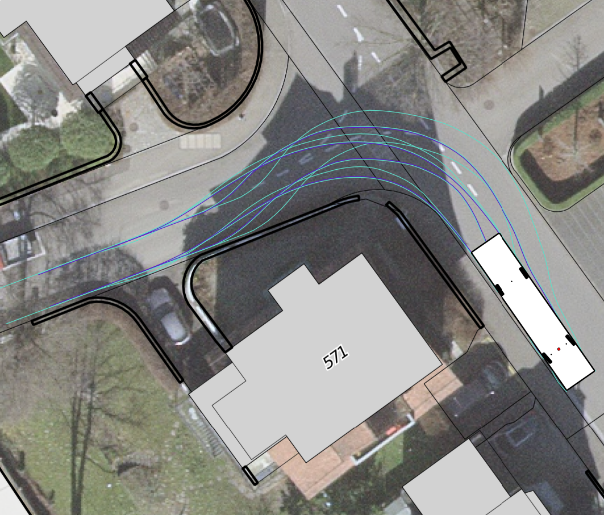
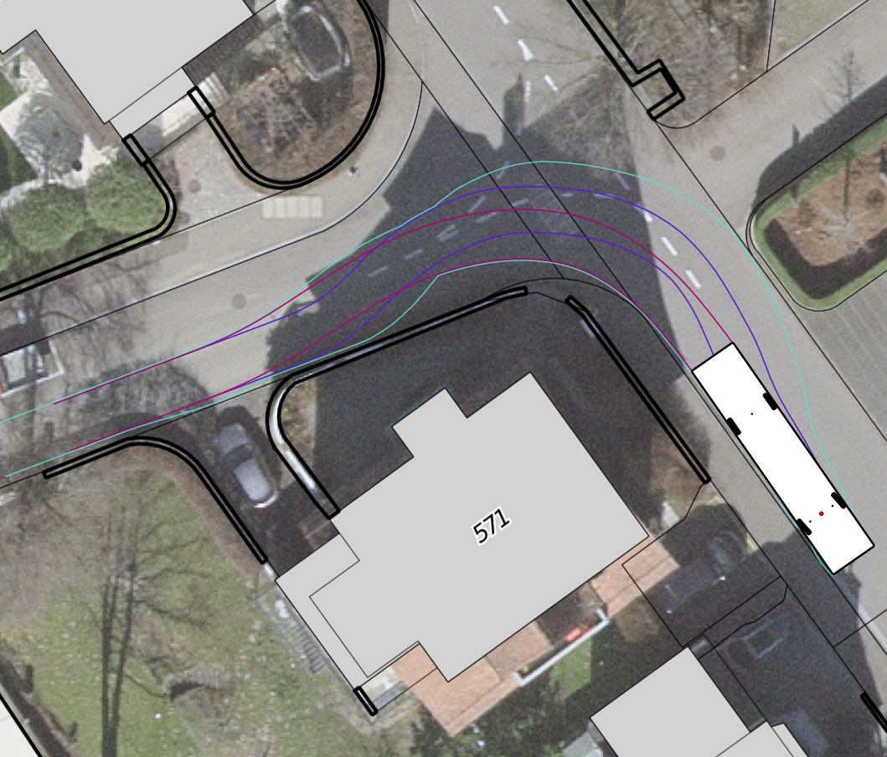
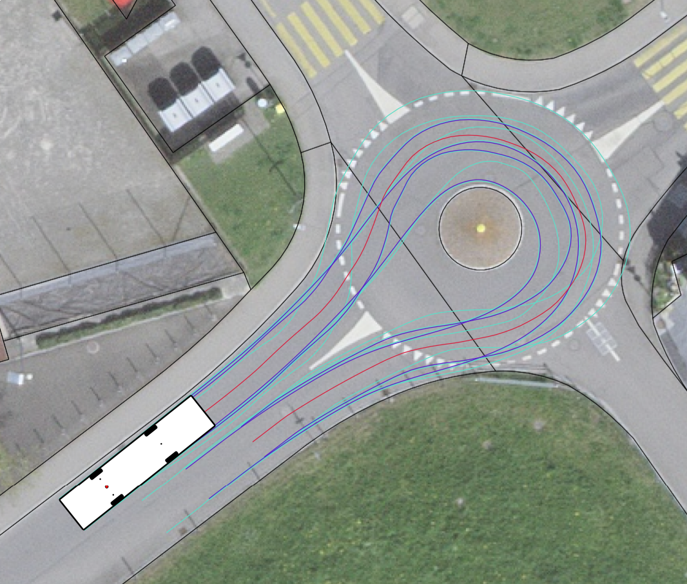
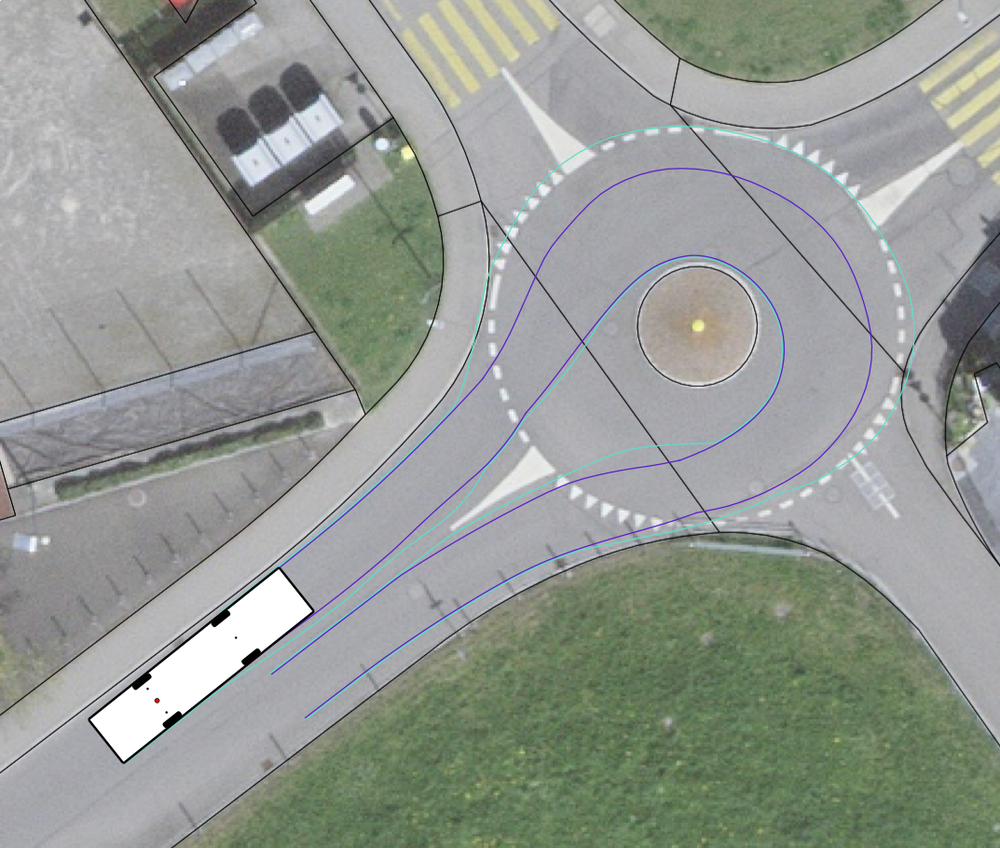
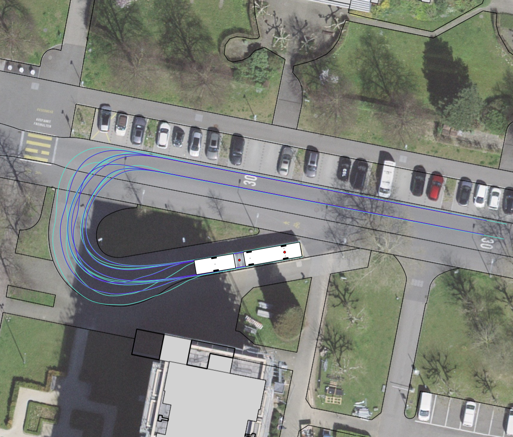

# Showcase
*QgisSweptPath Version 0.1.0*

---

## Simple examples
### Example 1: Standard bus T-junction

  

    
    
<em>Standard bus: Simulation results with basic symbolisation of the paths.  Background: © SWISSTOPO</em>

  

  

    
    
<em>Standard bus: Symbolisation customised and inner paths deleted.  Background: © SWISSTOPO</em>

  

### Example 2: Midibus roundabout

  

    
    
<em>Midibus: Simulation results with basic symbolisation of the paths.  Background: © SWISSTOPO</em>

  

  

    
    
<em>Midibus: Symbolisation customised and inner paths deleted.  Background: © SWISSTOPO</em>

  

### Example 3: Articulated bus turnaround point

  

    
    
<em>Articulated bus: Simulation results with basic symbolisation of the paths.  Background: © SWISSTOPO</em>

  

