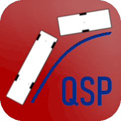

#  QgisSweptPath

#### EN
QgisSweptPath is a plug-in for the open source GIS software QGIS for simple sweep curve checks.
The plug-in is primarily suitable for rough feasibility studies and does not claim to achieve the accuracy and depth of analysis
of professional sweep curve simulation programmes for CAD systems.

For some examples see the page: [Showcase](showcase.md)

During the development of the plug-in, care is taken to ensure that the sweep paths correspond as closely as possible to real vehicles
and the simulation results are checked to the best of our knowledge and belief. Nevertheless, it cannot be guaranteed that
the simulation correctly reflects reality in all cases. The developers accept no responsibility for the correctness and
accuracy of the sweep path checks performed with this plug-in. The user is responsible for checking and validating the simulation results.

For the developers of QgisSweptPath, Lukas Gafner

---

#### DE
QgisSweptPath ist ein Plug-in für die Open-Source-GIS-Software QGIS für einfache Schleppkurvenprüfungen.
Das Plug-in ist vor allem für grobe Machbarkeitsabklärungen geeignet und hat nicht den Anspruch die Genauigkeit und Abklärungstiefe
von professionellen Schleppkurvensimulationsprogrammen für CAD-Systeme zu erreichen.

Für ein paar Anwendungsbeispiele siehe Seite: [Showcase](showcase.md)

Bei der Entwicklung des Plug-ins wird darauf geachtet, dass die Schleppkurven möglichst den realen Fahrzeugen entsprechen
und die Simulationsergebnisse werden nach bestem Wissen und Gewissen geprüft. Dennoch kann nicht gewährleistet werden, dass
die Simulation in allen Fällen die Realität korrekt abbildet. Die Entwickler übernehmen keine Verantwortung für die Richtigkeit und
Genauigkeit der mit diesem Plug-in durchgeführten Schleppkurvenprüfungen. Für die Überprüfung und Plausibilisierung der Simulationsergebnisse
ist der Anwender selber verantwortlich.

Für die Entwickler von QgisSweptPath, Lukas Gafner

---

https://lugafner.github.io/QgisSweptPath/img/RefImg_SweptPath.mp4

---

