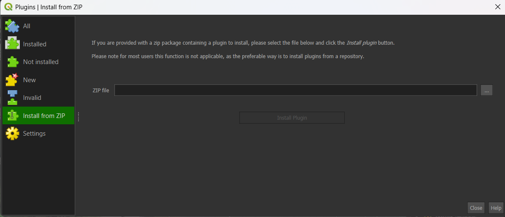
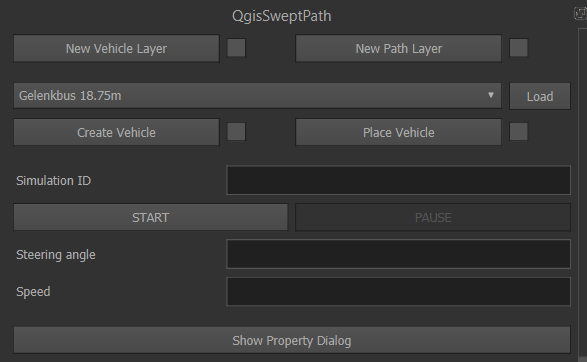

# Benutzerhandbuch

*QgisSweptPath Version 0.1.0*

---

## Inhalt
- [Einleitung](#einleitung)
- [Kurzanleitung](#kurzanleitung)
  - [QgisSweptPath starten](#qgissweptpath-starten)
  - [Fahrzeug- und Pfadlayer erstellen](#fahrzeug--und-pfadlayer-erstellen)
  - [Fahrzeug auswählen](#fahrzeug-auswählen)
  - [Fahrzeug platzieren](#fahrzeug-platzieren)
  - [Fahren](#fahren)
- [Einstellungen](#einstellungen)
  - [Layer](#layer)
  - [Plot Einstellungen](#plot-einstellungen)
  - [Layerdarstellung](#layerdarstellung)
  - [Karteneinstellungen](#karteneinstellungen)
  - [Frame basierte simulation](#frame-basierte-simulation)
  - [Schritt basierte simulation](#schritt-basierte-simulation)
  - [Pfadbearbeitung](#pfadbearbeitung)
- [Problembehandlung](#problembehandlung)
- [Infos für QGIS 4 Nutzer](#infos-für-qgis-4-nutzer)
- [Disclaimer](#disclaimer)

---

## Einleitung

Mit dem Plug-in **QgisSweptPath** können direkt im QGIS grobe Abklärungen zur Befahrbarkeit von Strassen, Knoten oder Haltestellen des öffentlichen Verkehrs durchgeführt werden. Dank der Integration in QGIS können als Hintergrund sämtliche Geodaten verwendet werden, wie zum Beispiel Orthofotos, Daten der amtlichen Vermessung oder auch georeferenzierte PDF oder Bilddateien. Ausserdem besteht die Möglichkeit, die generierten Schleppkurven wie normale QGIS-Layer weiterzubearbeiten oder die Darstellung anzupassen.

Das Plug-in eignet sich für schnelle, grobe Abklärungen und erreicht nicht die Genauigkeit und Benutzerfreundlichkeit professioneller CAD-Tools für Ingenieure. Das Tool insbesondere für Anwender geeignet, die für ihre Projekte ohnehin QGIS verwenden und so kein zusätzliches Programm für die Schleppkurvensimulationen einsetzen müssen.

QgisSweptPath wird zurzeit von einzelnen Personen betreut und weiterentwickelt. Aus diesem Grund gibt es keinen Support für Anwender. Falls Sie aber Fehler entdecken, oder sich bei der Weiterentwicklung einbringen möchten, können Sie ihr Anliegen gerne im offiziellen [Github-Repository](https://github.com/lugafner/QgisSweptPath) als [Issue](https://github.com/lugafner/QgisSweptPath/issues) erfassen.

## Kurzanleitung

### QgisSweptPath installieren

In der aktuellen Version 0.1.0 ist das Plugin noch nicht über das Plugin-Repository von QGIS verfügbar. Das Plugin muss direkt von Github heruntergeladen und manuell installiert werden. Der jeweils neuste Release ist [hier](https://github.com/lugafner/QgisSweptPath/releases) zu finden. Für die Installation muss die angehängte ZIP-Datei heruntergeladen und an einem beliebigen Ort abgespeichert werden.

Danach kann im Plugin-Manager von QGIS über **Aus ZIP Datei installieren** die heruntergeladene Datei ausgewählt werden. Das Plugin wird danach im QGIS Benutzerverzeichnis im Plugin-Ordner installiert. Sofern nicht automatisch geschehen muss danach in der Liste der installierten Plugins der Haken vor **QgisSweptPath** gesetzt werden.

### QgisSweptPath starten

QgisSweptPath wird beim Öffnen eines Projekts nicht automatisch gestartet. Das Plugin kann unter dem Menüpunkt **Plugins** - **QgisSweptPath** - **QgisSweptPath** geöffnet werden. Das Dock-Widget wird unten rechts angedockt.

### Fahrzeug- und Pfadlayer erstellen

Bevor QgisSweptPath das erste Mal verwendet werden kann, müssen zwei Layer erstellt werden: **Fahrzeuglayer** und **Pfadlayer**. Diese beiden Layer werden für die Darstellung des Fahrzeugs und die Generierung der Schleppkurven benötigt. Wurde das Plugin im gleichen QGIS-Projekt bereits verwendet, werden die Refernzen auf diese Layer beim Pluginstart automatisch geladen. Falls die Layer nicht mehr verfügbar sind, wird eine entsprechende Warnung angezeigt. Ansonsten können die folgenden beiden Schritte übersprungen werden.

#### Fahrzeuglayer erstellen

Der Fahrzeuglayer ist ein Temporärlayer. Theoretisch kann auch ein Layer mit einer anderen Datenquelle verwendet werden. Aus Performancegründen wird das jedoch nicht empfohlen. Um den Layer zu erstellen, kann die Schaltfläche **New Vehicle Layer** verwendet werden. Es wird ein neuer Layer mit der Bezeichnung **vehicle** im Projekt eingefügt. Dem Layer wird automatisch der hinterlegte Standardstil für die Darstellung der Fahrzeuge zugewiesen. Wenn die Layererstellung erfolgreich war, wird der Haken rechts von der Schaltfläche gesetzt. Dadurch wird die Schaltfläche gesperrt damit nicht unabsichtlich neue Layer erstellt werden. Muss ein neuer Fahrzeuglayer erstellt werden, muss zuerst die Check-Box deaktiviert werden. Wird ein neuer Fahrzeuglayer erstellt, während bereits ein Fahrzeuglyer registriert ist, wird die Referenz auf den neuen Layer geändert, d.h. die Fahrzeuge werden auch mit dem Stil des neuen Layers angezeigt.

In den Einstellungen kann auch manuell eine Referenz auf einen bestehenden Layer eingetragen werden. Siehe [hier](#layer).

#### Pfadlayer erstellen

Die Schleppkurven werden auf diesem Layer gezeichnet und mit dem entsprechenden Datenanbieter gespeichert. Die Funktionalität ist gleich wie beim Fahrzeuglayer [siehe Fahrzeuglayer erstellen](#fahrzeuglayer-erstellen).

Der einzige Unterschied ist, dass der Pfadlayer als permanenter Layer angelegt wird. Nach dem Klick auf die Schaltfläche **New Path Layer** wird ein neuer Polyline-Layer angelegt und der Dialog zum Speichern des Layers wird angezeigt. Wurde der Layer erfolgreich angelegt, wird die Schaltfläche mit dem Haken rechts davon gesperrt.

Beim Pfadlayer kann es vorkommen, dass ein bereits vorhandener Layer verwendet werden soll, z.B. wenn mehrere Schleppkurven in verschiedene Layer geschrieben werden sollten. Dazu kann die Referenz auf den Pfadlayer in den QgisSweptPath-Einstellungen manuell geändert werden. Siehe [hier](#layer).

### Fahrzeug auswählen

In der Auswahlbox unter den Schaltflächen für die Layererstellung kann das zu simulierende Fahrzeug ausgewählt werden. Standardmässig stehen dort alle mitgelieferten Fahrzeugtypen zur Auswahl. Diese Fahrzeugdefinitionen sind im Installationserzeichnis angelegt. QgisSweptPath bietet auch die Möglichkeit Fahrzeuge aus einem benutzerdefinierten Verzeichnis zu laden. Dazu muss das entsprechende Verzeichnis in den Einstellungen angegeben werden [siehe Benutzerfahrzeuge unter Layerdarstellung](#layerdarstellung). Die Details zur Erstellung von benutzerdefinierten Fahrzeugen werden in der [Entwicklerdokumentation](#) beschrieben (coming soon).

Nachdem das Fahrzeug ausgewählt wurde, muss das Fahrzeug erstellt werden. Dazu muss die Schaltfläche **Create Vehicle** betätigt werden. Die Aktion wird mit dem Haken rechts der Schaltfläche bestätigt. Wird für einen nächsten Simulationsdurchgang ein anderes Fahrzeug verwendet, kann dieses aus der Liste ausgewählt werden und ebenfalls mit der Schaltfläche erstellt werden. 

### Fahrzeug platzieren

Bevor die Simulation gestartet werden kann, muss das Fahrzeug platziert werden. Dazu ist die Schaltfläche **Place Vehicle** zu verwenden. Nach dem Klick auf die Schaltfläche wird am Mauszeiger auf dem Map-Canvas der Umriss des Fahrzeugs angezeigt (bei mehrteiligen Fahrzeugen wird nur das Zugfahrzeug dargestellt). 

Die Platzierung erfolgt über die linke und rechte Maustaste. Mit dem ersten Linksklick wird die Position des Fahrzeugs gesetzt. Danach kann das Fahrzeug mit der Maus um den Basispunkt gedreht werden. Sobald die Ausrichtung stimmt, kann das Platzieren mit einem Rechtsklick abgeschlossen werden. Muss stattdessen die Position nochmals korrigiert werden, kann statt dem Rechtsklick mit einem erneuten Linksklick wieder in den Verschiebemodus umgeschaltet werden. Der Prozess kann sowohl im Verschiebe- als auch im Rotationsmodus mit dem Rechtsklick abgeschlossen werden.

### Fahren

Die Simulation wird mit der Schaltfläche **START** gestartet. Alternativ kann die Tastenkombination **Ctrl+Shift+U** verwendet werden (oder eine eigene definierte Tastenkombination in den QGIS-Einstellungen). Das Fahrzeug hat in diesem Moment noch keine Geschwindigkeit und die Räder sind geradegestellt. Für die Simulation stehen zwei Methoden zur Verfügung. Hier wird die Standardmässig verwendete Methode beschrieben. Weitere Informationen zur alternativen Steuerung sind im Abschnitt [Schritt basierte Simulation](#schritt-basierte-simulation) ausgeführt.

Standardmässig wird die [Frame basierte Simulation](#frame-basierte-simulation) verwendet. Hierbei erfolgt die Simulation mit einer vordefinierten Framerate (Simulationsschritte pro Sekunde) ausgeführt. Die Voraussetzung für diesen Simulationsmodus ist, dass die Hardwareleistung die Simulationsberechnungen im vorgegebenen Zeitintervall ausführen kann ([siehe Problembehandlung](#problembehandlung)). 

Die Steuerung erfolgt bei der Frame basierter Simulation mit je einer einzelnen Taste. Standardmässig wird die folgende Belegung verwendet:
- **Beschleunigen**: I
- **Verlangsamen**: K
- **Nach rechts lenken**: L
- **Nach links lenken**: J

Diese Tasten können in den QgisSweptPath-Einstellungen (nicht QGIS-Einstellungen) angepasst werden ([siehe Frame basierte Simulation](#frame-basierte-simulation)). Wichtig ist, dass sich diese Tasten nicht mit in den QGIS-Einstellungen hinterlegten Tasten überlagern. Die Brems-, Beschleunigungs- und Lenkgeschwindigkeiten sind einem realen Fahrzeug nachempfunden. Diese Werte können in den QgisSweptPath-Einstellungen angepasst werden ([siehe Frame basierte Simulation](#frame-basierte-simulation)).

Während die Simulation läuft, wird anstelle von **START** die Schaltfläche **STOP** zum Beenden der Simulation angezeigt. 
Sofern in den Einstellungen das Zeichnen der Schleppkurve eingeschaltet ist ([siehe Plot Einstellungen](#plot-einstellungen)) wird nach dem Beenden der Pfad gezeichnet. Je nach ausgewählter Auflösung, Datenanbieter und Datenspeicherort kann dieser Vorgang einige Zeit in anspruch nehmen. Danach wird der Pfad auf dem Pfadlayer angezeigt.

Für kurze Unterbrechungen kann die Simulation mit der Schaltfläche **PAUSE** (oder **Ctrl+Shift+O**) unterbrochen werden. Der Pfad wird in diesem Moment noch nicht gezeichnet. Da die Berechnungen für die Simulation im Hintergrund weiterlaufen, kann eine pausierte Simulation Auswirkungen auf die Performance vom QGIS haben.

## Einstellungen

Dieser Dialog umfasst alle Einstellungen für die Berechnung, Visualisierung und Steuerung der Simulation. Der Dialog kann über die Schaltfläche **Properties** im Haupt-Widget geöffnet werden.

### Layer

#### Vehicle layer

ID des Kartenlayers zur Darstellung des Fahrzeugs (Visualisierung). Dieser Wert wird automatisch eingetragen, wenn im Hauptfenster ein neuer Layer erstellt wird. Diese ID wird im QGIS-Projekt gespeichert und bei einem erneuten Start des Projekts automatisch geladen. Falls der Layer mit dieser ID im Projekt nicht existiert, muss auf der Hauptseite ein neuer Vehicle Layer für die Darstellung generiert werden.

Falls ein bestehender Layer im Projekt als Vehicle Layer verwendet werden soll, kann durch den Klick auf das Häkchen das Textfeld entsperrt werden. So kann manuell eine Layer-ID eines vorhandenen Kartenlayer eingetragen werden (Punktlayer).

#### Path layer

ID des Kartenlayers zur Darstellung und Speicherung des generierten Pfads (Ergebnis). Diese Einstellung verhält sich gleich wie die Einstellung [Vehicle layer](#vehicle-layer).

### Plot Einstellungen

- **Print path**: Gibt an, ob nach Abschluss der Simulation die Schleppkurve im Path Layer gespeichert werden soll. Default: True
- **Print interval**: Betrifft nur die schrittbasierte Simulation. Gibt an, nach wie vielen Schritten ein Punkt für die Pfadgenerierung gespeichert werden soll. Default: 2
- **Print distance**: Betrifft nur die Frame basierte Simulation. Gibt an, in welcher Distanz (Karteneinheiten) ein Punkt für die Pfadgenerierung gespeichert werden soll. Default: 1.0

### Layerdarstellung

- **Default vehicle layer style und Default path layer style** definiieren die Standardstile für die Fahrzeug- und Pfadlayer. Diese Stile werden automatisch zugewiesen, wenn ein neuer Layer über die Schaltflächen auf der Hauptseite erstellt wird. Es kann ein absoluter oder relativer Pfad (relativ zum Plugin-Verzeichnis) zu einer QGIS-Style-Datei (.qml) angegeben werden.  Default: ./style/vehicle.qml & ./style/path.qml 
- **Reload Vehicle Layer Style und Reload Path Layer Style** laden die Standardstile vom Dateisystem und weisen sie neu zu.
- **User vehicle packages** gibt die Verzeichnisse an, in denen benutzerdefinierte Fahrzeugdefinitionen abgelegt sind. Es können mehrere Verzeichnisse angegeben werden. Diese werden durch ein Semikolon getrennt. Default: leer

### Karteneinstellungen

- **Minimum speed**: Gibt die minimale Fahrgeschwindigkeit an. Unter dieser Geschwindigkeit wird das Fahrzeug angehalten. Default: 0.01
- **Auto map movement**: Gibt an, ob die Karte automatisch mit dem Fahrzeug mitbewegt werden soll (siehe auch die zwei folgenden Parameter). Default: True
- **Min. border distance**: Gibt die Distanz zum Kartenrand an, bei welchem die Karte mitbewegt wird. Die Einheit wird mit dem Parameter **Border distance units** definiert. Default: 5
- **Border distance units**: Gibt die Einheit für die minimale Distanz zum Kartenrand an. Es kann zwischen Pixel und Karteneinheiten gewählt werden. Bei **Pixel** ist der Abstand unabhängig vom Kartenmassstab immer gleich gross. Bei **Karteneinheiten** passt sich der Abstand dem aktuellen Kartenmassstab an, sodass er bei grossen Massstäben grösser erscheint als bei kleinen. Default: Karteneinheiten.

### Frame basierte Simulation

Bei der Frame basierten Simulation erfolgt die Simulation mit einer vordefinierten Framerate (Simulationsschritte pro Sekunde). Die Voraussetzung für diesen Simulationsmodus ist, dass die Hardwareleistung die Simulationsberechnungen im vorgegebenen Zeitintervall ausführen kann ([siehe Problembehandlung](#problembehandlung))

- **Frame based simulation**: Gibt an, ob die Simulation frame basiert ausgeführt werden soll. Default: True
- **Frames**: Gibt die Anzahl Simulationsschritte pro Sekunde an. Default: 24
- **Acceleration/deceleration**: Gibt den Wert für die Beschleunigung und Verzögerung in m/s² an. In der aktuellen Version können für Bremsen und Beschleunigen keine unterschiedlichen Werte definiert werden. Default: 2.5
- **Steering time**: Gibt die Zeit in Sekunden an, die benötigt wird, um von einem maximalen Lenkeinschlag zum anderen zu lenken. Darüber wird die Lenkgeschwindigkeit gesteuert. Default: 6
- **Key steer left, Key steer right, Key speed up und Key speed down**: Tastenbelegung für die Steuerung der Simulation. In der aktuellen Version können nur einzelne Tasten definiert werden (keine Tastenkombinationen). Wichtig ist, dass sich diese Tasten nicht mit in den QGIS-Einstellungen hinterlegten Tasten überlagern. Default: J, L, I und K

### Schritt basierte Simulation

*Step based simulation, Step distance, Speed change step und Steer change step*

Bei der Schritt basierten Simulation wird die Position des Fahrzeugs nach einer vordefinierten Distanz berechnet. Der Lenkwinkel und die Geschwindigkeit werden für jeden Schritt angewendet. Somit ist die Genauigkeit (d.h. die Auflösung der Simulation) von der Schrittdistanz abhängig. Je kleiner die Schrittdistanz, desto genauer wird das Ergebnis. Anders als beim Print interval der Frame basierten Simulation wird nicht nur die Darstellung, sondern auch die Simulationsgenauigkeit beeinflusst. Die Schritt basierte Simulation ist vorteilhaft bei begrenzter Hardwareleistung. Allerdings erfolgt die Steuerung bei langsamen Geschwindigkeiten und grossen Simulationsschritten ruckartig. Ein weiterer Vorteil ist, dass die Tastenbelegung über die QGIS-Einstellungen definiert werden kann.
- **Step based simulation**: Gibt an, ob die Simulation Schritt basiert ausgeführt werden soll. Default: False
- **Step distance**: Gibt die Distanz in Karteneinheiten an, nach der die Position des Fahrzeugs berechnet wird. Default: 0.05
- **Speed change step**: Gibt die Änderung der Geschwindigkeit in m/s an, die pro Tastendruck angewendet wird. Default: 0.01
- **Steer change step**: Gibt die Änderung des Lenkwinkels in Grad an, die pro Tastendruck angewendet wird. Default: 0.5

### Pfadbearbeitung

*Dissolve path und Dissolve by fields*

Funktionen in Version 0.1.0 noch nicht verfügbar.

## Problembehandlung

### QGIS-Absturz während der Simulation

- Bei Frame basierter Simulation (Standardeinstellung)
  - Framerate reduzieren ([siehe Frame basierte Simulation](#frame-basierte-simulation))
  - Schritt basierte Simulation verwenden ([siehe Schritt basierte Simulation](#schritt-basierte-simulation))
- Bei Schritt basierter Simulation
  - Fahrgeschwindigkeit reduzieren
  - Schrittdistanz erhöhen ([siehe Schritt basierte Simulation](#schritt-basierte-simulation))

---

## Infos für QGIS 4 Nutzer

Die aktuelle Version 0.1.0 des QgisSweptPath-Plungins ist für QGIS 3 entwickelt und wurde mit QGIS 3.44 LTR getestet. Eine Aktualisierung auf QT6 und damit die Kompatibilität mit QGIS 4 ist mit dem kommenden Release 1.0.0 geplant. 

---

## Disclaimer

Bei der Entwicklung des Plug-ins wird darauf geachtet, dass die Schleppkurven möglichst den realen Fahrzeugen entsprechen und die Simulationsergebnisse werden nach bestem Wissen und Gewissen geprüft. Dennoch kann nicht gewährleistet werden, dass die Simulation in allen Fällen die Realität korrekt abbildet. Die Entwickler übernehmen keine Verantwortung für die Richtigkeit und Genauigkeit der mit diesem Plug-in durchgeführten Schleppkurvenprüfungen. Für die Überprüfung und Plausibilisierung der Simulationsergebnisse ist der Anwender selber verantwortlich.
